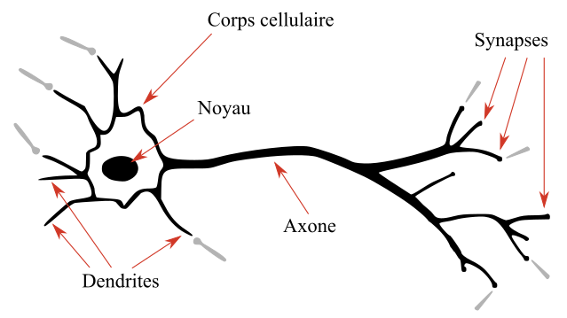

# Introduction au DEEP learning

## Definition:

- Le machine learning est un domaine de l'IA qui consiste à programmer une machine pour que celle-ci apprenne à réaliser des tâches en étudiant des exemples de ces dernières.

- D'un point de vue mathématique, ces exemples sont représentés par des données que la machine utilise pour développer un modele.

- Si nous prenons par exemple des données qui semblent être distribue selon la distribution linéaire  `f(x) = à x + b`. Le but du Machine learning serait de trouver les paramètres `à` et `b` qui donnent le meilleur modele possible, et donc qui s'ajuste le mieux à nos données.

- Dans ce cas simple, les meilleurs paramètres `a` et `b` sont ceux qui minimisent le plus la distance entre les données et le modèle.

- D'une autre façon, le ML consiste à développer un modèle en se servant d'un algorithme d'optimisation pour minimiser les erreurs entre les modèle et nos données.

## Modeles de ML:

- On en cite plusieurs, des `modèles linéaires`, des `arbres de décision` et des `supports vector Machines`. Chacun de ses modeles vient avec son propre algorithme d'optimisation:

`modèles linéaires -> Descente de gradient`
`Arbres de decision -> Algorithme CART`
`Support vector machines -> Marge maximum`

- Le Deep learning est un domaine du machine learning dans lequel, au lieu de developper un des modeles ci-dessous, on developpe a la place un reseau de neurones artificiels. 

- Le principe en soit est le meme, on fournit a la machine des donnees et celle ci va se servir d'un algorithme d'optimisation pour ajuster le modele a ces donnnes.

- Cependant, cette fois ci, notre modele n'est pas une simple fonction `f(x) = a*x + b` mais un reseau de fonction connectees les unes aux autres appelle **reseau de neurones**. Plus ces reseaux sont profonds (contient plus de fonctions a l'interieur), plus la machine est capable d'apprendre a realiser des taches complexes (reconnaissance d'objets et de personnes, conduction de voitures etc...).

## Histoire des reseaux de neurones artificiels

- Historiquement, le premier neurone a ete developpee par Warn McCulloc et Walter Pitts en s'inspirant du fonctionnement du neurone biologique. 

### Fonctionnement d'un neurone biologique

- Les neurones sont des cellules excitables connectées les unes aux autres et ayant pour role de transmettre des informations dans notre systeme nerveux. Ils sont formes de **dendrites**, un **corps cellulaire** et un **axone**. 

- Les dendrites sont les portes d'entrée d'un neurone. A l'entrée d'une dendrite (la synapse), le neurone recoit des signaux lui provenant des neurones qui le precedent. 

- Ces signaux peuvent etre de type éxcitateur ou inhibiteur (c'est comme si on avait des signaux qui valent +1 et d'autres qui valent -1). Lorsque la somme de ces signaux dépasse un certain seuil, le neurone s'active et produit un signal éléctrique. Ce signal circule le long de l'axone en direction des terminaisons pour etre envoyé a son tour vers d'autres neurones de notre systeme nerveux qui fonctionnent de la meme facon biensur.

- Warren et Pitts ont essayé de modéliser ce comportement en supposant qu'un neurone pouvait etre modélisé par une fonction de transfert qui prent en entrée des signaux **X** et qui retourne une sortie **Y**. A l'interieur de cette fonction, il y'a deux grandes étapes. La premiere est une étape d'aggrégation, on fait la somme de toutes les entrées du neurone en multipliant au passage chaque entrée par un coeffiscient W. Ce coeffiscient représente en fait l'activité synaptique:

- Aggrégation: 
`f = w_1 x_1 + w_2 x_2 + w_3 x_3`

- Activation: 
`\left\{ 
y = 1 si f > 0 \\
y = 0 sinon
\right\}`

